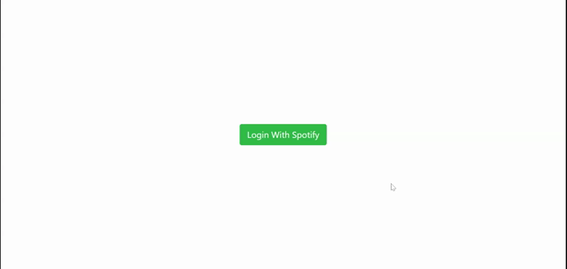

<h1 align="center">TuneSpot</h1> 
  <h2>Table of Contents<h2>
  <ul>
    <li>
     <a href="#description">Description</a>
    </li>
    <li>
      <a href="#demo">Demo</a>
    </li>
    <li>
      <a href="#instructions">Instructions</a>
    </li>
    <li>
      <a href="#tech">Technology</a>
    </li>
    <li>
      <a href="#license">License</a>
    </li>
    <li>
      <a href="#contributors">Contributors</a>
    </li>
  </ul>
    

  
<h2>Description</h2>

  
A React music player that consumes the Spotify Web API. 
   
  Features user authentication by way of Express server routes and custom hook that uses web tokens. 
   
  Styled with Bootstrap.

  

  
<h2>Demo</h2>

  

  

  
<h2>Instructions</h2> 

  

    ** Currently implementing authentication routes for deployed application.
     
    For the moment, the app must be run locally:
     
    - Clone or fork this repository.
     
    - In terminal, run `npm start`
     
    - Log in (requires Spotify premium account).
  

  
  

  
  
<h2>Technology</h2>
           
  
React.js, Node/Express.js, Spotify Web API, Bootstrap

  
  

  
  
<h2>License</h2>

  

  
   
  

  
  
<h2>Contributors</h2> 

  <h4>
    Github:
      <a href="https://github.com/gregroyclark/" target="_blank">
    https://github.com/gregroyclark/
      </a>
  
  <h4>